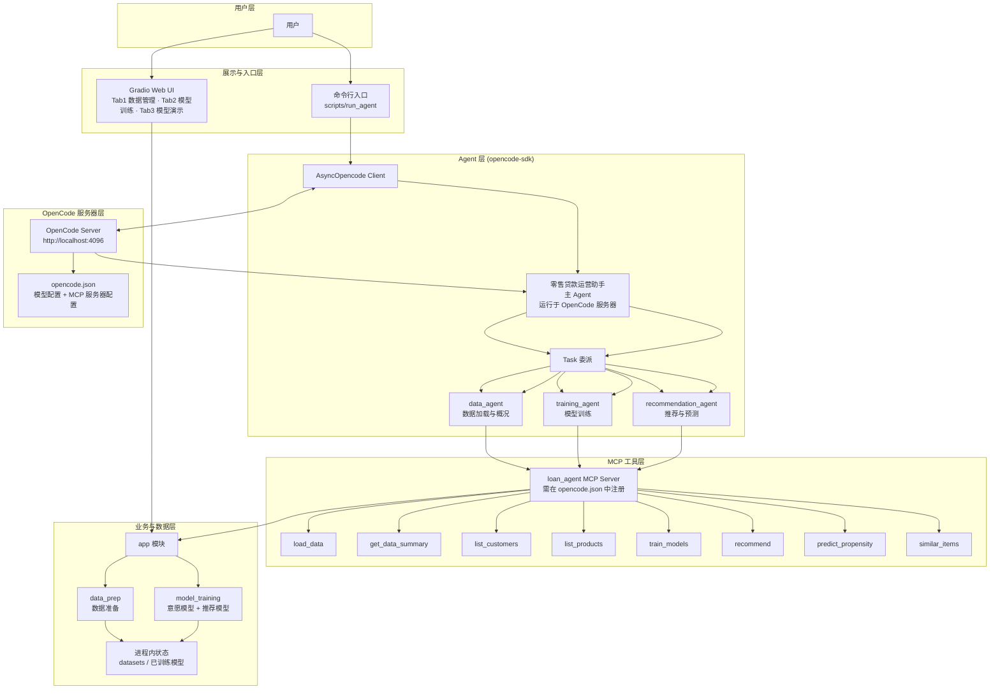
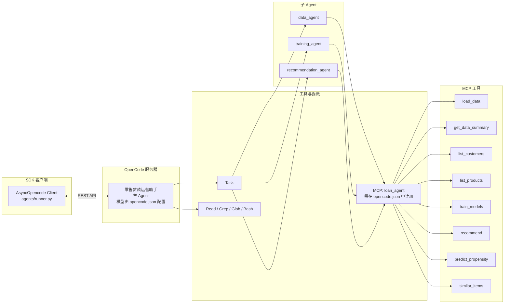
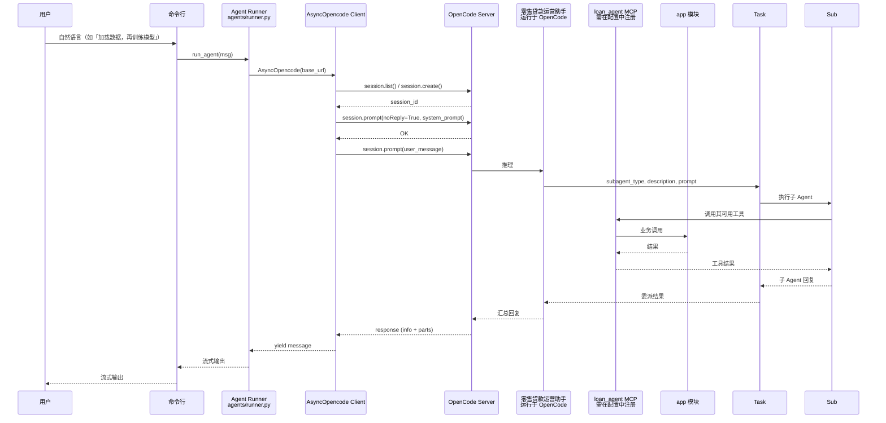
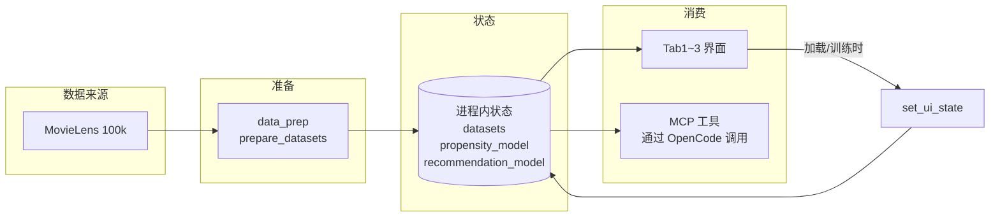
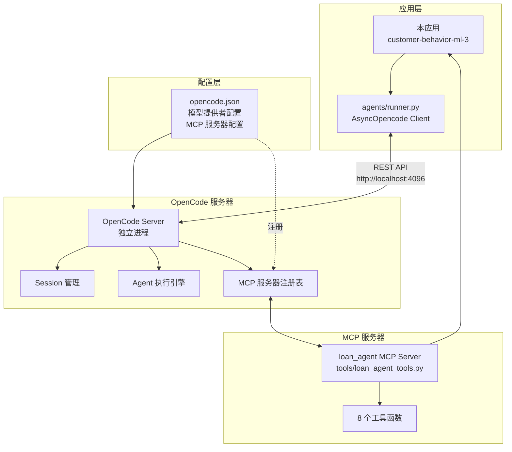

# 零售贷款智能运营 — 架构设计图

本文档用 Mermaid 图系统展示整体架构，可在支持 Mermaid 的 Markdown 查看器（如 GitHub、VS Code 插件、Typora）中直接渲染。

---

## 1. 系统总体架构（分层视图）



**说明**：用户通过 Gradio 使用数据管理、模型训练、模型演示三个步骤（直接操作 app 与状态）；或通过命令行入口（`scripts/run_agent`）与主 Agent 交互。主 Agent 运行于 OpenCode 服务器，由 opencode-sdk 通过 REST API 调用，模型配置由 `opencode.json` 管理。**主 Agent 必须通过 Task 委派子 Agent 来完成所有业务操作，不能直接调用 MCP 工具**；子 Agent 负责调用相应的 MCP 工具，工具实现落在 app 模块并共享进程内状态。

**重要说明**：子 Agent 是**可选参与**业务流程的。主 Agent 可以选择：
- **方式一**：直接调用 MCP 工具（更直接、快速）
- **方式二**：通过 Task 委派给子 Agent（适合多步骤或需要专项分析的场景）

即使没有配置子 Agent，主 Agent 仍然可以通过直接调用 MCP 工具完成所有业务功能。子 Agent 提供了更专业化的任务处理方式，但不是必需的。

---

## 2. Agent 与 Sub-Agent、MCP 调用关系



**说明**：主 Agent 运行于 OpenCode 服务器，通过 opencode-sdk 客户端（`AsyncOpencode`）进行交互。**主 Agent 只能调用 Task（委派子 Agent）和内置工具（Read/Grep/Glob/Bash），不能直接调用 MCP 工具**；三个子 Agent 各自只能调用其职责范围内的 MCP 工具：data_agent 调用 load_data、get_data_summary、list_customers 和 list_products；training_agent 调用 train_models；recommendation_agent 调用 recommend、predict_propensity 和 similar_items。子 Agent 需要在 `opencode.json` 配置文件中注册。

---

## 3. 命令行 Agent 对话请求流



**说明**：仅命令行入口（`python -m scripts.run_agent`）触发此流。用户输入经 Runner 进入 SDK，SDK 通过 REST API 与 OpenCode 服务器交互；OpenCode 服务器中的主 Agent **必须通过 Task 委派子 Agent**；子 Agent 调 MCP → app，结果逐级返回并以流式消息输出到控制台。

---

## 4. 模块与文件映射

```mermaid
flowchart TB
    subgraph 入口与配置
        main[main.py]
        run[scripts/run_agent.py<br/>命令行对话]
        config[core/config.py<br/>OPENCODE_BASE_URL / 端口]
    end

    subgraph UI
        ui_app[ui/app.py]
        ui_help[ui/helpers.py]
    end

    subgraph Agent
        def[agents/definitions.py<br/>主 Agent system prompt<br/>子 Agent 定义]
        runner[agents/runner.py<br/>使用 AsyncOpencode 调用 OpenCode]
    end

    subgraph Tools
        loan_tools[tools/loan_agent_tools.py<br/>MCP 工具实现 + set_ui_state<br/>get_loan_agent_tools()]
    end

    subgraph 业务
        data_prep[app/data_prep.py]
        model_train[app/model_training.py]
    end

    subgraph 流式与数据
        consumer[streaming/consumer.py]
        data_dir[data/]
    end

    subgraph OpenCode 配置
        oc_config[opencode.json<br/>模型配置 + MCP 服务器注册]
    end

    main --> config & ui_app
    run --> runner
    ui_app --> loan_tools & ui_help
    ui_app --> data_prep & model_train
    runner --> def & loan_tools & config
    loan_tools --> data_prep & model_train
    runner --> consumer
    runner -.->|通过 REST API| oc_config
    oc_config -.->|配置| loan_tools
```

**说明**：根目录仅保留 `main.py`；配置在 `core/config.py`，命令行 Agent 对话在 `scripts/run_agent.py`。Web UI（`ui/app.py`）仅含数据管理、模型训练、模型演示三个 Tab，不调用 runner；Agent 仅由 `scripts/run_agent` 调用。数据与模型状态在 `loan_agent_tools` 的进程内状态中，供 UI 与命令行 Agent 共用。OpenCode 服务器需要配置 `opencode.json` 以注册 MCP 服务器、工具和子 Agent。

---

## 5. 数据与状态流



**说明**：数据经 data_prep 产出后写入进程内状态；界面操作（加载、训练）通过 `set_ui_state` 同步状态，命令行 Agent 通过 OpenCode 服务器调用 MCP 工具读写同一状态。

---

## 6. OpenCode 集成架构



**说明**：本应用通过 opencode-sdk 与 OpenCode 服务器交互。OpenCode 服务器是独立进程，负责管理 session、执行 Agent、注册和调用 MCP 服务器。MCP 服务器（loan_agent）需要在 `opencode.json` 中注册，工具函数实现在 `tools/loan_agent_tools.py` 中。

---

## 与 customer-behavior-ml-2 的主要区别

1. **Agent 执行方式**：
   - ml-2: 使用 `claude-agent-sdk` 直接调用 Claude Code CLI，Agent 在本地进程执行
   - ml-3: 使用 `opencode-sdk` 通过 REST API 调用 OpenCode 服务器，Agent 在服务器端执行

2. **子 Agent 配置**：
   - ml-2: 使用 `claude-agent-sdk` 的 `AgentDefinition` 在代码中定义子 Agent，通过 `ClaudeAgentOptions.agents` 注入
   - ml-3: 子 Agent 定义在 `agents/definitions.py` 中提供，但需要在 `opencode.json` 配置文件中注册才能使用

3. **配置方式**：
   - ml-2: 通过 `core/config.py` 的 `LLM_BACKEND` 配置模型后端
   - ml-3: 通过 `opencode.json` 配置文件管理模型、MCP 服务器和子 Agent

4. **工具注册**：
   - ml-2: 使用 `claude-agent-sdk` 的 `create_sdk_mcp_server` 在代码中创建 MCP 服务器
   - ml-3: 需要在 `opencode.json` 中配置 MCP 服务器，工具定义通过 `get_loan_agent_tools()` 提供

5. **子 Agent 功能**：
   - 两个项目都支持相同的 3 个子 Agent（data_agent、training_agent、recommendation_agent）
   - 功能完全一致，只是配置方式不同

6. **工作流程设计**：
   - ml-2: 主 Agent 可以选择直接调用 MCP 工具或通过 Task 委派子 Agent（两种方式都支持）
   - ml-3: **主 Agent 必须通过 Task 委派子 Agent 完成所有业务操作**，不能直接调用 MCP 工具（强制通过子 Agent 的工作流程）

---

以上六图从**分层总览、Agent/MCP 关系、对话时序、模块映射、数据状态、OpenCode 集成**六方面描述架构；若需导出为 PNG/SVG，可使用 [Mermaid Live Editor](https://mermaid.live) 或 VS Code 的 Mermaid 插件渲染后导出。
